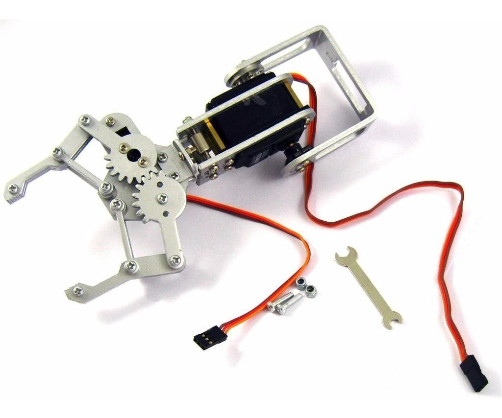
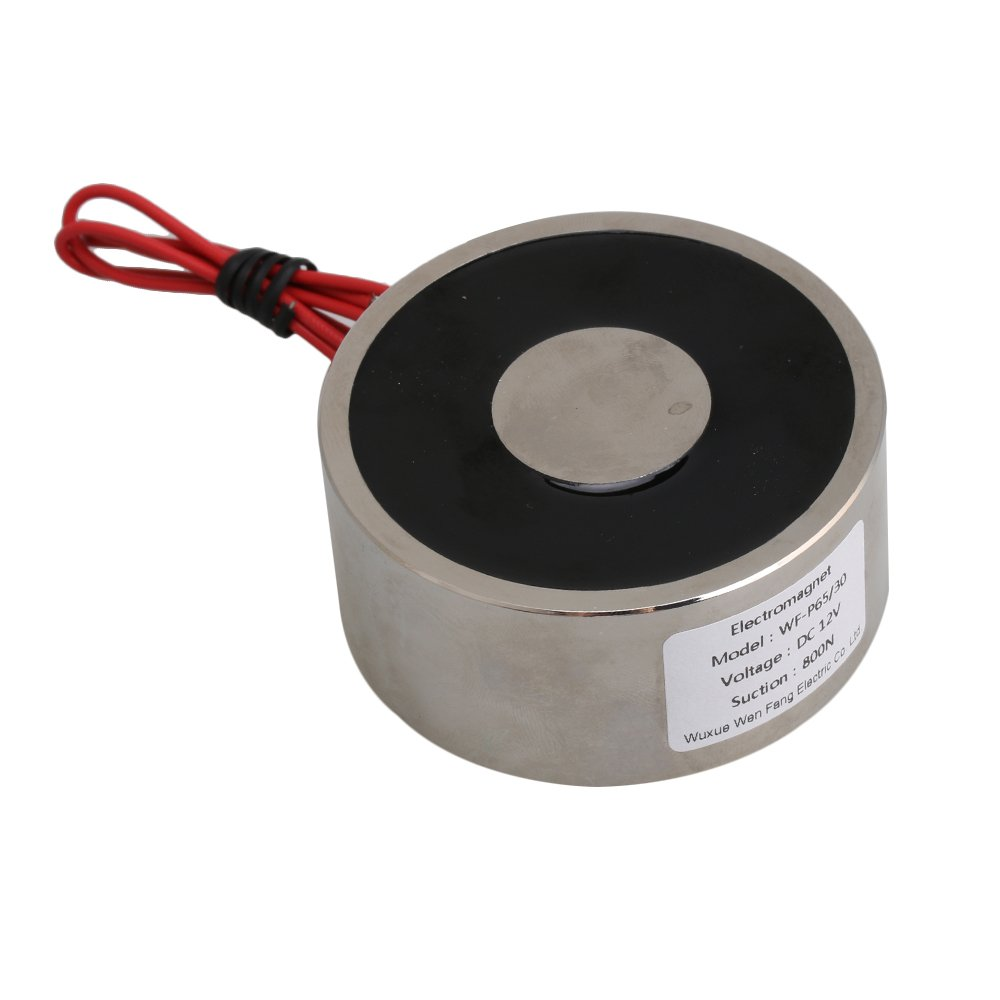

<h1>Importar paquete de SolidWorks a ROS con MoveIt</h1>

A pesar de que sw2urdf genera varios archivos, es necesario hacer algunos cambios para simular nuestro robot.

Los paquetes de ROS tienen un estandar, donde se recomienda (aunque no es obligatorio) **empezar por una letra minúscula y contener SOLO letras minúsculas, dígitos, guiones bajos y guiones**. No recomiendo los guiones (solo los guiones bajos), pero deben seguir esas instrucciones al exportar el robot en SolidWorks. 

<h2>Índice</h2>

<- El paso anterior es [Exportar SolidWorks a URDF](sw2urdf.md)

- [Importar proyecto en Ubuntu](#importar-proyecto-en-ubuntu)
  - [En resumen:](#en-resumen)
- [Copiar a Ubuntu el paquete del robot](#copiar-a-ubuntu-el-paquete-del-robot)
- [Editar CMakeLists.txt](#editar-cmakeliststxt)
- [Editar package.xml](#editar-packagexml)
- [Modificar el URDF](#modificar-el-urdf)
  - [El mundo como eslabón](#el-mundo-como-eslabón)
  - [Articulación con mímica](#articulación-con-mímica)
  - [Electroimán](#electroimán)
  - [Transmisión](#transmisión)
  - [Plugin de gazebo para el controlador](#plugin-de-gazebo-para-el-controlador)
  - [Autocolisión](#autocolisión)
- [Definir controladores de ROS usando YAML](#definir-controladores-de-ros-usando-yaml)
- [MoveIt Setup Assistant](#moveit-setup-assistant)


## Importar proyecto en Ubuntu

Los pasos descritos aquí aparecen en su mayoría en el pdf con el [tutorial de Age of Robotics](https://github.com/ageofrobotics/import_your_custom_urdf_package_to_ROS-main/blob/main/Importing_URDF_Package_from_Soloidworks_in_ROS.pdf), los cuales se pueden ver también en [youtube](https://www.youtube.com/watch?v=ZWliEJfNtlM). Aun así, recomiendo seguir los primeros pasos para crear el Workspace dentro del repositorio de GitHub de la materia.

Entren a Ubuntu e importen el repositorio de ustedes del proyecto de robótica desde GitHub (cambien `UsuarioDeGitHub` y `RepositorioRobotica` y dejen al final `~/Robotica`); recomiendo guardarlo en una carpeta llamada Robotica para que sea más fácil seguir el tutorial.
```bash
git clone https://github.com/UsuarioDeGitHub/RepositorioRobotica.git ~/Robotica
```
Una vez dentro, en Visual Studio Code abran la carpeta desde `Archivo` -> `Abrir carpeta...` para trabajar con GitHub desde ahí.

Ahora, convertirán el proyecto en un Workspace de ROS. Un Workspace permite crear paquetes o bibliotecas locales que no interfieran con otros Workspaces, por lo que es algo similar al proyecto de Matlab. Para convertirlo en un Workspace, abre un terminal y asegúrate de estar en la carpeta del proyecto; la pueden llamar como `Robotica` (según este tutorial) o `moveit_ws` (según el tutorial del pdf) para no batallar en copiar y pegar.

```bash
cd ~/Robotica
catkin init
```

Verifican que no hay un error grande, como haber creado un workspace dentro de otro workspace. Después ejecuten

```bash
catkin build
```

Esto creará las siguientes carpetas:
- `src/`: donde colocamos los **paquetes** (como `mi_robot`, `tutorial` o `sensores_genericos`). Yo les dije que por estandar, ya debíamos tener esa carpeta.
- `build/`: donde se guardan archivos temporales de compilación.
- `devel/`: donde se instalan los paquetes ya compilados.
- `log/`: registros de la compilación.

Si está configurado bien `.gitignore`, deberían de verse de color gris y no deberían de aparecer como spam de cientos de modificaciones de git. 

El comando `catkin build` se usa para compilar el código máquina de C++, por lo que si un paquete usa C++, es necesario usar el comando cada vez que se cambia el código. Python utiliza algo llamado intérprete que le permite que se lea diréctamente el código en lenguaje de alto nivel, por lo que no es necesario convertirlo a código máquina y, por lo tanto, no es necesario usar `catkin build` cada vez que se modifique el código. Sin embargo, sí es necesario usarlo al crear un nuevo paquete para que ROS los encuentre automáticamente.

Ahora, cada vez que se abra una terminal, para que use el Workspace, es necesario ejecutar (dentro de la carpeta del workspace):

```bash
source devel/setup.bash
```

Pero si solo usarás un workspace y no varios, se puede añadir al archivo `.bashrc` para que siempre se ejecute al abrir el terminal con
 ```bash
 echo 'source ~/Robotica/devel/setup.bash' >> ~/.bashrc
 source ~/.bashrc
```

O puedes hacerlo desde el navegador de Windows entrando a `Linux\Ubuntu-20.02\home\$USUARIO\.bashrc`, aunque también puedes usar Visual Studio Code o abrir el editor de ubuntu con

```bash
gedit ~/.bashrc
```

Y añade `source ~/Robotica/install/setup.bash` para que asiempre se ejecute. Recuerda cerrar y abrir el terminal para que haga efecto.

### En resumen:
1. Abrir Ubuntu 20.04.
2. Clonar repositorio en la carpeta Robotica.
```bash
git clone https://github.com/UsuarioDeGitHub/RepositorioRobotica.git ~/Robotica
```

3. Abrir carpeta en Visual Studio Code.
4. Verificar que se puede crear el Workspace
```bash
cd ~/Robotica
catkin init
```
5. Crear Workspace.
```bash
catkin build
```
5.  Abrirlo por defecto en terminal.
```
echo 'source ~/Robotica/install/setup.bash' >> ~/.bashrc
source ~/.bashrc
```

## Copiar a Ubuntu el paquete del robot

Lo siguiente es copiar todos los archivos y carpetas del paquete generado por `sw2urdf` al generado en la carpeta `src/`.

## Editar CMakeLists.txt
El archivo `CMakeLists.txt` contiene la configuración de C++, por lo que los nodos programados en ese lenguaje deben añadirse ahí. También se añaden los paquetes necesarios para ejecutar el paquete, por lo que si su archivo se parece a esto

```cmake
cmake_minimum_required(VERSION 2.8.3)

project(MI_ROBOT)

find_package(catkin REQUIRED)

catkin_package()

find_package(roslaunch)

foreach(dir config launch meshes urdf)
	install(DIRECTORY ${dir}/
		DESTINATION ${CATKIN_PACKAGE_SHARE_DESTINATION}/${dir})
endforeach(dir)
```
Deben cambiarlo a esto. Recuerden cambiar `MI_ROBOT` por el de su paquete.

```cmake
cmake_minimum_required(VERSION 2.8.3)

project(MI_ROBOT)

find_package(catkin REQUIRED COMPONENTS
	message_generation
	roscpp
	rospy
	std_msgs
	geometry_msgs
	urdf
	xacro
	message_generation
)
catkin_package(
	CATKIN_DEPENDS
		geometry_msgs
		roscpp
		rospy
		std_msgs
)

find_package(roslaunch)

foreach(dir config launch meshes urdf)
	install(DIRECTORY ${dir}/
		DESTINATION ${CATKIN_PACKAGE_SHARE_DESTINATION}/${dir})
endforeach(dir)
```

## Editar package.xml
También tienen que cambiar el archivo `package.xml`. Cambien donde dice `MI_ROBOT`, el autor y correo. Si quieren poner múltiples autores, solo tienen que poner la linea de <author> y <maintainer> varias veces hasta que estén todos los integrantes.

```xml
<package format="2">
  <name>MI_ROBOT</name>
  <version>1.0.0</version>
  <description>
    <p>URDF Description package for MI_ROBOT</p>
    <p>This package contains configuration data, 3D models and launch files
for MI_ROBOT robot</p>
  </description>
  <author>TODO</author>
  <maintainer email="TODO@email.com" />
  <license>BSD</license>
  <buildtool_depend>catkin</buildtool_depend>
  <build_depend>message_generation</build_depend>
  <build_depend>roscpp</build_depend>
  <build_depend>rospy</build_depend>
  <build_depend>std_msgs</build_depend>
  <build_depend>geometry_msgs</build_depend>
  <build_depend>urdf</build_depend>
  <build_depend>xacro</build_depend>
  <build_depend>std_msgs</build_depend>
  <build_depend>message_generation</build_depend>
  <depend>roslaunch</depend>
  <depend>robot_state_publisher</depend>
  <depend>rviz</depend>
  <depend>joint_state_publisher</depend>
  <depend>joint_state_publisher_gui</depend>
  <depend>gazebo</depend>
  <depend>moveit_simple_controller_manager</depend>
  <build_export_depend>roscpp</build_export_depend>
  <build_export_depend>rospy</build_export_depend>
  <build_export_depend>std_msgs</build_export_depend>
  <build_export_depend>geometry_msgs</build_export_depend>
  <build_export_depend>urdf</build_export_depend>
  <build_export_depend>xacro</build_export_depend>
  <exec_depend>roscpp</exec_depend>
  <exec_depend>rospy</exec_depend>
  <exec_depend>std_msgs</exec_depend>
  <exec_depend>geometry_msgs</exec_depend>
  <exec_depend>urdf</exec_depend>
  <exec_depend>xacro</exec_depend>
  <exec_depend>message_runtime</exec_depend>
  <export>
    <architecture_independent />
  </export>
</package>
```

El archivo `package.xml` contiene una lista de los paquetes necesarios para que este paquete funcione. Si intentan compilar de nuevo con `catkin build`, probablemente aparezca un error porque no tienen instalado un paquete. Es por ello que una práctica común es ejecutar
```bash
cd ~/Robotica
rosdep update
rosdep install --from-paths src --ignore-src -r -y
catkin build
```
para instalar todos los paquetes que se encuentran en `package.xml` y compilarlo.

## Modificar el URDF
Ahora se debe modificar el URDF para que se pueda simular en gazebo. Este archivo describe todos los componentes del robot usando el lenguaje xml. 

En xml, una etiqueta empieza con `<` y termina con `/>`. Si queremos que una etiqueta contenga varias etiquetas dentro, se puede poner en una línea `<etiqueta>` y en otra línea `</etiqueta>` con el mismo nombre pero con `/`, de forma que todo lo que esté dentro de las dos forme parte de `etiqueta`.

Para más información sobre URDF, pueden ver en la [página de ROS](https://wiki.ros.org/urdf/XML) en detalle. Su estructura básica se puede ver en el siguiente ejemplo:
```xml
<?xml version="1.0"?>
<robot name="robot_genérico">
  <!--
    <robot>
      Describe todas las propiedades de un robot.
  -->

  <!--
    <link>
      Describe las propiedades cinemáticas y dinámicas de un eslabón.
  -->
  <link name="base_link">
    <!-- 
      Aquí irían <inertial>, <visual> y <collision> si quisiéramos masa, geometría, etc.
    -->
  </link>
  <link name="link_1"/>

  <!--
    <joint>
      Describe las propiedades cinemáticas y dinámicas de una articulación.
  -->
  <joint name="joint1" type="revolute">
    <parent link="base_link"/>
    <child  link="link_1"/>
    <origin xyz="0 0 1" rpy="0 0 0"/>
    <axis   xyz="0 0 1"/>
    <!-- Límites de torque y velocidad -->
    <limit effort="10" velocity="1.0" lower="-1.57" upper="1.57"/>
    <!--
      <dynamics>
        En URDF estándar se usa para damping y friction
    -->
    <dynamics damping="0.1" friction="0.2"/>
  </joint>

  <!--
    <transmission>
      Conecta actuadores (motores) con joints y define relación mecánica.
  -->
  <transmission name="joint1_trans">
    <type>transmission_interface/SimpleTransmission</type>
    <joint name="joint1"/>
    <actuator name="motor1">
      <!-- gear ratio: torque_joint = torque_motor × reduction -->
      <mechanicalReduction>10</mechanicalReduction>
    </actuator>
  </transmission>

  <!--
    <gazebo>
      Bloque de configuración específico para simulación en Gazebo:
      aquí anidamos sensores, plugins, fricción/damping a nivel de link/joint, etc.
  -->
  <gazebo reference="link_1">
    <!--
      <sensor>
        Describe un sensor (ej. láser, cámara) dentro de Gazebo.
    -->
    <sensor type="ray" name="laser_sensor">
      <update_rate>10</update_rate>
      <ray>
        <scan>
          <horizontal>
            <samples>5</samples>
            <min_angle>-1.57</min_angle>
            <max_angle> 1.57</max_angle>
          </horizontal>
        </scan>
        <range>
          <min>0.1</min>
          <max>5.0</max>
        </range>
      </ray>
    </sensor>
  </gazebo>

</robot>
```

### El mundo como eslabón
Lo primero es fijar el robot en el mundo para que no se tambalee ni se caiga. Para eso se añade debajo de `<robot  name="MI_ROBOT">` el eslabón `world` y la articulación `base_joint`. Cabe destacar que si nombraron diferente a la primera articulación, entonces no debe ir `base_link` (y probablemente tampoco `base_joint`), sino algo así como `link_0` y `joint_0`.
```xml
<robot
  name="MI_ROBOT">
```
```xml
  <link name="world"/>
  <joint name="base_joint" type="fixed">
    <parent link="world"/>
    <child link="base_link"/>
    <origin rpy="0 0 0" xyz="0.0 0.0 0.17"/>
  </joint>
```
```xml
  <!-- Lo que sigue del robot-->
  <link
    name="base_link">
    <inertial>
```

### Articulación con mímica
La mayoría de robots con pinzas como efector final tienen un solo actuador para mover dos articulaciones porque suelen estar centradas e invertidas usando engranes, como la que se muesstra en la imagen.



Para lograr eso, se simula que una articulación está haciendo mímica de otra. En el ejemplo de abajo, `joint_7` hace mímica del `joint_6`, por lo que si movemos `joint_6`, automáticamente se hará el mismo movimiento con el `joint_7`. Entonces nunca debemos mover el `joint_7` ya que físicamente no debería de haber un motor ahí.

```xml
  <joint
    name="joint_7"
    type="prismatic">
    <origin/>
    <parent/>
    <child/>
    <axis/>
    <limit/>
    <dynamics/>
```
```xml
    <mimic
      joint="joint_6"
      multiplier="1"
      offset="0" />
```
```xml
  </joint>
```

### Electroimán
Si el robot que tienen usa un electroimán como efector final, tendrán que añadirlo. usualmente los venden con forma cilíndrica como se muestra en la imagen, pero tienen que añadir el eslabón que lo represente.



El siguiente ejemplo muestra un eslabón magnético con:
- masa (mass): 0.5 kg
- geometría (geometry): cilindro
  - radio (radius): 2.5 cm (0.025 m)
  - longitud (length): 3 cm (0.03 m)

Y lo tendrían que añadir después del último `</joint>` por ejemplo.

```xml
  <!-- Link del electroimán -->
  <link name="magnet_link">
    <!-- Inercia aproximada (ajusta masa si quieres más realismo) -->
    <inertial>
      <mass value="0.5"/>              <!-- 0.5 kg como ejemplo -->
      <origin xyz="0 0 0" rpy="0 0 0"/>
      <inertia 
        ixx="0.0001" ixy="0.0" ixz="0.0"
        iyy="0.0001" iyz="0.0"
        izz="0.0001"/>
    </inertial>

    <!-- Geometría visual -->
    <visual>
      <origin xyz="0 0 0" rpy="0 0 0"/>
      <geometry>
        <cylinder radius="0.025" length="0.03"/>
      </geometry>
      <material name="Gray">
        <color rgba="0.3 0.3 0.3 1.0"/>
      </material>
    </visual>

    <!-- Geometría de colisión -->
    <collision>
      <origin xyz="0 0 0" rpy="0 0 0"/>
      <geometry>
        <cylinder radius="0.025" length="0.03"/>
      </geometry>
    </collision>
  </link>

  <!-- Joint fijo que une el imán al link_5 -->
  <joint name="magnet_joint" type="fixed">
    <parent link="link_5"/>
    <child  link="magnet_link"/>
    <!-- Ajusta el xyz para situar el cilindro justo donde va montado -->
    <origin xyz="0 0 0.10" rpy="0 0 0"/>
  </joint>
```

### Transmisión
La etiqueta de transmisión es necesaria para usar `ros_control`, pero permite simular una caja de engranajes o un reductor de velocidad.

Pueden agregarlas antes de `</robot>`, que es la última etiqueta. Debe ser una por cada articulación (si tienen 4 articulaciones, deben de copiar y pegar el código 4 veces) y solo deben cambiar `joint_n` y `link_n` con el número correspondiente.

```xml
  <transmission name="link_n_trans">
    <type>transmission_interface/SimpleTransmission</type>
    <joint name="joint_n">
      <hardwareInterface>hardware_interface/PositionJointInterface</hardwareInterface>
    </joint>
    <actuator name="link_n_motor">
      <hardwareInterface>hardware_interface/PositionJointInterface</hardwareInterface>
      <mechanicalReduction>1</mechanicalReduction>
    </actuator>
  </transmission>
```
```xml
</robot>
```
- `<mechanicalReduction>`: es el gear ratio, es decir, la relación entre el eje del motor y la articulación.
  - Si pones `1`, dices que no hay transmisión (velocidad y torque uno a uno).
  - Si tu caja de engranajes es, por ejemplo, 10:1, pones `10`.
- **Efecto sobre torque y velocidad**:
  - **Torque en el joint** = *torque del motor* × **mechanicalReduction**
  - **Velocidad del joint** = v*elocidad del motor* ÷ **mechanicalReduction**

Pueden poner que los motores tienen ya la fuerza total y que la transmisión solo tiene una reducción mecánica de `1`, pero si quieren hacerlo más realista, pueden poner la fuerza y velocidad máxima del motor que viene en la hoja de datos dentro de cada articulación en 
```xml
  <joint
    name="joint_n"
    type="revolute">
    <limit
      effort="999"
      velocity="999" />
  </joint>
```
y el gear ratio que diga la caja de engranajes que usen dentro de `<mechanicalReduction>`.

### Plugin de gazebo para el controlador
La etiqueta <gazebo> es para parámetros específicos del simulador homónimo. Pueden ser parámetros globales como el que está abajo o para algún eslabón o articulación específica, como el que viene en el ejemplo de [Autocolisión](#autocolisión) con `<gazebo reference="link_n">`.

Podemos hacer que el simulador Gazebo haga todas las cosas avanzadas que queramos usando plugins. Algunos ya están hechos en Gazebo como el que aparece aquí, pero podríamos programar los nuestros en python o C++. 

Solo tienen que añadir esto antes de `</robot>`.
```xml
  <gazebo>
    <plugin 
      name="control"
      filename="libgazebo_ros_control.so">
      <robotNamespace>/</robotNamespace>
    </plugin>
  </gazebo>
```
```xml
</robot>
```

### Autocolisión
 
`<selfCollide>` permite que los eslabones que se pueden mover, no se atraviesen entre sí, como ocurre en la vida real. También se tiene que poner la etiqueta para cada eslabón, así que copien lo siguiente el número de veces que los eslabones del robot.
```xml
  <gazebo reference="link_n">
    <selfCollide>true</selfCollide>
  </gazebo>
```

## Definir controladores de ROS usando YAML
Se debe crear un archivo `.yaml` en la carpeta "config" del paquete de ROS del robot. Este archivo contendrá un controlador de articulaciones para:
- articulaciones del brazo robótico
- articulaciones del efector final
- publicar los estados de las articulaciones y cualquier otro
controlador según sea necesario
YAML es un lenguaje de marcado (con etiquetas) al igual que XML. La diferencia es que YAML es mucho más fácil de leer. 


```yaml
# config/joint_trajectory_controller.yaml

# Controlador de las articulaciones del brazo
robot_arm_controller:
  type: "position_controllers/JointTrajectoryController"
  joints: 
    - joint_1
    - joint_2
    - joint_3
    - joint_4
    - joint_5

```

Añadan lo siguiente **si su robot tiene un efector final con forma de pinzas**. Si las articulaciones se controlan por separado, añadan las dos, pero **si solo controlan una, añadan solo la que no hace mimetismo** como se explicó en la sección [Articulación con mímica](#articulación-con-mímica).

```yaml
# Controlador de las articulaciones del efector final
hand_ee_controller:
  type: "position_controllers/JointTrajectoryController"
  joints: 
    - joint_6
    - joint_7

```

También lo siguiente para que se publique la información continuamente.

```yaml
# Controlador que publica continuamente los estados/posiciones de las articulaciones. 
joint_state_controller:
  type: "joint_state_controller/JointStateController"
  publish_rate: 50  # Frecuencia en Hz
```

## MoveIt Setup Assistant

Un tutorial más completo viene en la [página oficial](https://moveit.github.io/moveit_tutorials/doc/setup_assistant/setup_assistant_tutorial.html) y es el que recomiendo que sigan, pero igual pueden ver [el PDF](https://github.com/ageofrobotics/import_your_custom_urdf_package_to_ROS-main/blob/2e713d1acf99981a315667f32bbb82ab184ffcfe/Importing_URDF_Package_from_Soloidworks_in_ROS.pdf) que hizo AgeofRobotics o su video que aparece en el PDF.