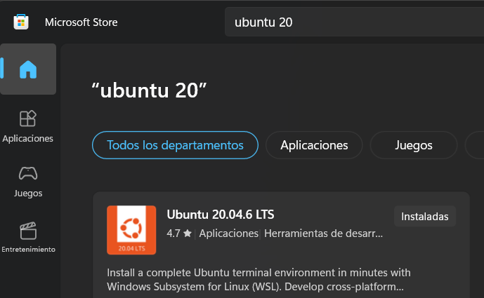
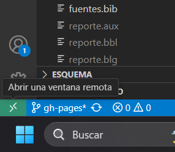
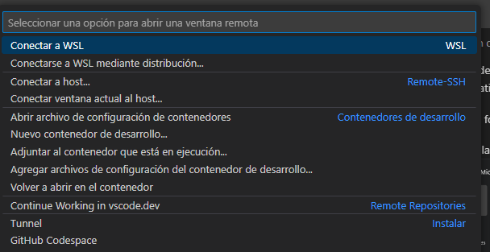

<h1>Instalación de Ubuntu 20 en WSL</h1>

WSL (Windows Subsystem for Linux) permite usar el Kernel de linux dentro de windows, de forma que no tengas que cambiar de sistema operativo y sea mucho menos pesado (Aproximadamente 10 GB en total). 

<h2>Índice</h2>

- [¿Quieres instalarlo en un lugar diferente al disco C?](#quieres-instalarlo-en-un-lugar-diferente-al-disco-c)
- [¿Aparece root en vez de tu usuario?](#aparece-root-en-vez-de-tu-usuario)
  - [1. Crear un nuevo usuario](#1-crear-un-nuevo-usuario)
  - [2. Configurar el usuario de inicio](#2-configurar-el-usuario-de-inicio)
  - [3. Configurar usuario predeterminado](#3-configurar-usuario-predeterminado)
- [Olvidaste la contraseña?](#olvidaste-la-contraseña)
- [¿Aparece el error 0x800701bc y no te permite entrar?](#aparece-el-error-0x800701bc-y-no-te-permite-entrar)

-> Para instalar ROS, ve a [Instalación de ROS y Gazebo](Instalacion-Ros.md).
___

Existen varias formas de instalar Ubuntu. 
1. Desde la terminal de **PowerShell** con privilegios de administrador. Puedes abrir la aplicación **terminal** en Windows 11 para ello, aunque también se puede descargar desde la Microsoft Store. No es necesario, pero te permite abrir varias pestañas o seleccionar entre todas las terminales instaladas.
```powershell
wsl --install -d Ubuntu-20.04
```
2. Desde la Microsoft Store buscando Ubuntu 20:
   


3. Desde **Visual Studio Code**, presionando el botón con el símbolo [><]



Y seleccionando Conectar a WSL mediante distribución. Si nunca lo haz instalado, usa conectar a WSL y aparecerá una ventana que pide instalar una distribución, así que selecciona la que dice `Ubuntu 20.04 LTS`.



## ¿Quieres instalarlo en un lugar diferente al disco C?
1. Descarga la [imagen de Ubuntu 20.04](https://aka.ms/wslubuntu2004).
2. Importa la imagen a WSL2:
   * Abre PowerShell con privilegios de administrador.
   * Ejecuta el siguiente comando, reemplazando `D:\WSL\Ubuntu20` por la ruta donde deseas almacenar la nueva instancia (recuerda crear una nueva carpeta antes) y `C:\ruta\al\archivo\descargado.tar.gz` por la ruta al archivo que descargaste:
    ```powershell
    wsl --import Ubuntu-20 C:\WSL\Ubuntu20 C:\ruta\al\archivo\descargado.tar.gz --version 2
    ```
3. Inicia la nueva instancia:
   * Una vez importada, inicia la nueva distribución con:

    ```powershell
    wsl -d Ubuntu-20
    ```
   * Esto abrirá una terminal de la nueva instancia de Ubuntu 20 donde podrás realizar configuraciones adicionales según tus necesidades.
## ¿Aparece root en vez de tu usuario?

### 1. Crear un nuevo usuario

Si al iniciar no te pide el usuario o ves que aparece `root` en la terminal, puedes seguir los siguientes pasos (recuerda cambiar `miusuario` por el usuario que creaste cada vez que aparezca).
1.  Crear un usuario escribiendo dentro de la terminal de Ubuntu:
```bash
adduser miusuario
```
* Cuando te pida contraseña y detalles, introdúcelos o presiona ENTER para omitir (La contraseña se oculta, así que no te asustes si parece que el teclado no funciona).

2. Agrega el usuario al grupo de **sudo** para que tenga permisos administrativos:
```bash
 usermod -aG sudo miusuario
```
### 2. Configurar el usuario de inicio
Para que Ubuntu 20 en WSL2 inicie directamente con el usuario nuevo en lugar de root, debes cambiar la configuración de WSL:
1. Ejecuta en **PowerShell**:
```powershell
wsl -d Ubuntu-20.04 --user miusuario
```
* Esto iniciará la sesión con el usuario `miusuario`

2. Comprueba dentro de Ubuntu si se seleccionó correctamente
### 3. Configurar usuario predeterminado
Si después de seguir los pasos anteriores sigue iniciando como **root**, prueba forzar el cambio manualmente editando el archivo `/etc/wsl.conf` **dentro de WSL**. Puedes abrir el explorador de archivos de Windows y abrir la carpeta `\\wsl.localhost\Ubuntu-24.04\etc` o en la terminal de Ubuntu, escribir:
```bash
sudo nano /etc/wsl.conf
```
Luego, agrega el siguiente contenido:
```ini
[user]
default=miusuario
```
Para guardar los cambios, presiona `Ctrl + X` (guardar), luego `Y` (aceptar) y ENTER (usar nombre actual). Entonces reinicia WSL en **PowerShell** con:
```powershell
wsl --shutdown
```
Vuelve a abrir Ubuntu 20 y verifica el usuario.

## Olvidaste la contraseña?
Para cambiar la contraseña, el proceso es similar al de cambiar de cuenta.
1. Primero inicia sesión como **usuario root** ejecutando en **PowerShell**:
```powershell
wsl -d Ubuntu-20.04 --user root
```
2. Cambia la contraseña de tu usuario con lo siguiente (recuerda cambiar miusuario con el tuyo):
```bash
passwd miusuario
```

3. Cierra la terminal y usa ubuntu normalmente.

## ¿Aparece el error 0x800701bc y no te permite entrar?
Probablemente se interrumpió la instalación por el internet, lo que corrompió algunos archivos. Para resolverlo, haz lo siguiente: 
1. Busca en el explorador de Windows la carpeta `%LOCALAPPDATA%\Packages` y borra las carpetas que empiecen con `Canonical`. No importa si no encuentras ninguna.
2. Ejecuta **PowerShell** como administrador las siguientes lineas:
    ```powershell
    dism.exe /online /disable-feature /featurename:Microsoft-Windows-Subsystem-Linux /norestart
    dism.exe /online /disable-feature /featurename:VirtualMachinePlatform /norestart
    ```
3. Reinicia la PC.
4. Abre **PowerShell** como administrador y ejecuta 
```powershell
wsl --install
```
5. Vuelve  a [Instalación de Ubuntu 20 en WSL](#instalación-de-ubuntu-20-en-wsl) o a [¿Quieres instalarlo en un lugar diferente al disco C?](#quieres-instalarlo-en-un-lugar-diferente-al-disco-c).

Para instalar ROS, ve a [Instalación de ROS y Gazebo](Instalacion-Ros.md)