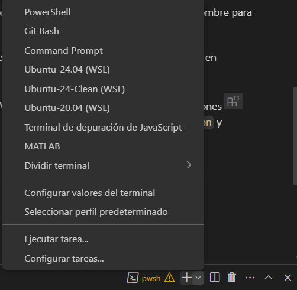

# Configuración de proyectos de robótica con python
Si prefieren usar pytohn en vez de Matlab para hacer los proyectos, es recomendable que sigan los siguientes pasos para abrir el proyecto.
## Instalación
### 1. Instalar python
Pueden ir a la [página principal](https://www.python.org), seleccionar Downloads y Download for windows (o el sistema operativo que tengan). Pueden usar la versión más nueva de python si desean, que es la que aparece ahí, pero yo personalmente recomiendo la versión 3.12 porque es más compatible con varias cosas. Pueden descargarla de [aquí](https://www.python.org/downloads/), donde dice _"Looking for a specific release?"_ y en el botón `Download` para la versión más nueva de python 3.12.X.

Recuerden activar la casilla `Add python.exe to PATH`. Recomiendo entrar a `Customize Installation` y activar las opciones como se muestran en la imagen


También si no quieren batallar encontrando la ubicación de python después, seleccionen `Install python 3.12 for all users`.


Para asegurarse de que se haya instalado, abren un nuevo terminal (no uno que ya tenían abierto) y ejecutan
```powershell
py -V
```
Y ahí aparecerá la versión de python que tienen instalada.

## 2. Creación del entorno virtual
Ahora hay que crear un entorno virtual para hacer las pruebas. Lo recomiendo porque así evitas problemas de compatibilidad. para crearlo, ejecutas en terminal

```powershell
py -m venv venv
```

donde `venv` es el nombre de la carpeta donde se guardará el entorno virtual. Puedes usar ese nombre para no batallar y si quieres borrarlo, basta con eliminar la carpeta.

Para entrar al entorno virtual, depende de la terminal que uses.



Por ejemplo, en PowerShell (la terminal que deberías de usar en Windows) se usa

Para instalar las extensiones de Visual Studio Code, ve al símbolo de extensiones  que se encuentra en la barra de la izquierda. Busca las extensiones de `Python` y `Jupyter`. Las de Microsoft son bastante confiables.