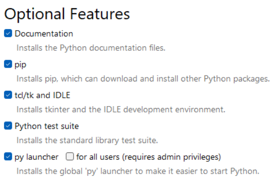
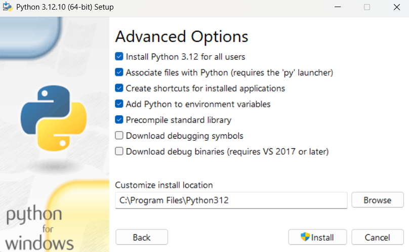
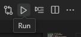
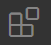
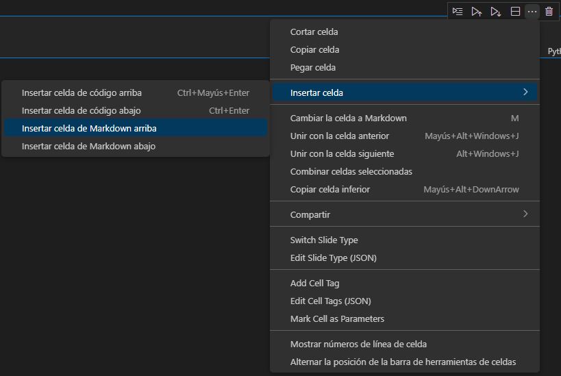

# Configuración de proyectos de robótica con python
Si prefieren usar pytohn en vez de Matlab para hacer los proyectos, es recomendable que sigan los siguientes pasos para abrir el proyecto.
## Instalar python
Pueden ir a la [página principal](https://www.python.org), seleccionar Downloads y Download for windows (o el sistema operativo que tengan). Pueden usar la versión más nueva de python si desean, que es la que aparece ahí, pero yo personalmente recomiendo la versión 3.12 porque es más compatible con varias cosas. Pueden descargarla de [aquí](https://www.python.org/downloads/), donde dice _"Looking for a specific release?"_ y en el botón `Download` para la versión más nueva de python 3.12.X.

Recuerden activar la casilla `Add python.exe to PATH`. Recomiendo entrar a `Customize Installation` y activar las opciones como se muestran en la imagen



También si no quieren batallar encontrando la ubicación de python después, seleccionen `Install python 3.12 for all users`.



Para asegurarse de que se haya instalado, abren un nuevo terminal (no uno que ya tenían abierto) y ejecutan
```powershell
py -V
```
Y ahí aparecerá la versión de python que tienen instalada.

## Creación del entorno virtual
Al igual que en Matlab abrían el archivo Robotica.prj, de forma que las bibliotecas que creaban se iban añadiendo al proyecto, se hará algo similar en Python usando un entorno virtual. Lo recomiendo porque así evitas problemas de compatibilidad en caso de que instales otra versión de python o tengas múltiples proyectos.

Para abrir el entorno, pueden usar Visual Studio Code, abrir el archivo `Robotica.ps1` en Windows (Se abrirá una terminal de PowerShell) o `Robotica.sh` en Ubuntu (terminal bash de linux) y entonces ejecutar el archivo con el botón Run que se encuentra en la esquina superior derecha.



**Cada vez que quieran abrir un terminal usando el entorno virtual, deberían de ejecutar el archivo**.

## Instalar extensiones

Para instalar las extensiones de Visual Studio Code, ve al símbolo de extensiones  que se encuentra en la barra de la izquierda. Busca las extensiones de `Python` y `Jupyter`. Las de Microsoft son bastante confiables.

# Jupyter notebook
Jupyter es una herramienta muy parecida a los Matlab Livescripts ya que permite ejecutar bloques de código, mostrar texto usando Markdown o ecuaciones usando LaTeX. De esta forma, es más sencillo en el contexto académico explicar o ejecutar un código y aprender su funcionamiento. 

## Crear Notebook de Jupyter
En Visual Studio Code, pueden usar su selector de comandos para crear un nuevo Notebook de Jupyter presionando `Ctrl`+`Shift`+`P`. Si escriben `jupyter`, debería autocompletarse como `Create: New Jupyter Notebook`.

## Seleccionar Kernel de Jupyter
Si abren un Notebook de Jupyter, lo más probable es que en la esquina superior derecha aparezca un mensaje que diga `Select kernel`. Esto es porque el kernel de Jupyter se instaló dentro de el entorno virtual. Es por ello que cuando lo abran, tienen que seleccionar el que se encuentra en `src\python\venv\Scripts\python.exe`. Si no aparece por defecto y seleccionan `Kernel de Jupyter`, debería llamarse `Python (Robótica)`.

## Crear celda de Jupyter
Esto permite añadir un bloque te código o un bloque de texto (markdown). Seleccionan los 3 puntos (…) y ahí aparecen las opciones.

