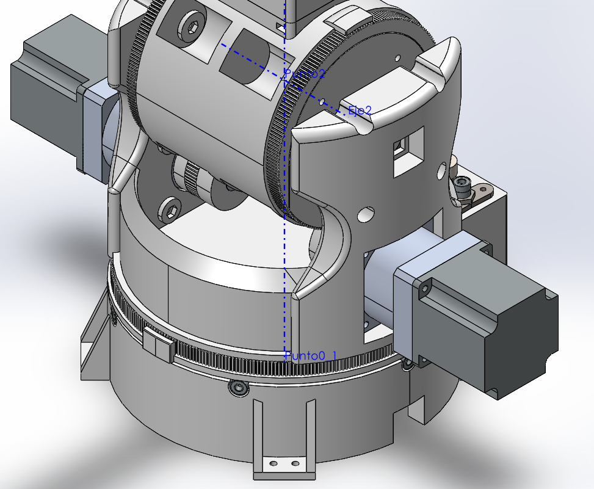

- [Preparación del robot en SolidWorks](#preparación-del-robot-en-solidworks)
  - [SolidWorks: Eje Z vertical](#solidworks-eje-z-vertical)
  - [SolidWorks: Relación de posición](#solidworks-relación-de-posición)
  - [SolidWorks: Ejes de articulaciones](#solidworks-ejes-de-articulaciones)
  - [Solidworks: Puntos](#solidworks-puntos)
  - [SolidWorks: Sistemas de referencia](#solidworks-sistemas-de-referencia)
  - [Buscar información del robot](#buscar-información-del-robot)
- [*SolidWorks to URDF Exporter* (sw2urdf)](#solidworks-to-urdf-exporter-sw2urdf)
  - [Instalación del plugin](#instalación-del-plugin)
  - [Exportar Robot de SolidWorks a URDF](#exportar-robot-de-solidworks-a-urdf)

# Preparación del robot en SolidWorks
Para poder hacer nuestro robot en SolidWorks y poder usarlo en ROS con MoveIt, es necesario seguir unos pasos dentro de SolidWorks y no basta símplemente con exportarlo.

## SolidWorks: Eje Z vertical
Primero, se recomienda cambiar el eje vertical para que sea el eje Z en vez del eje Y. Esto nos evitará unos pasos adicionales más tarde ya que en gazebo, el eje Z es el eje vertical.

Para hacer esto, selecciona en `Orientación de vista` y en `Más opciones`.

Después en `Desplegable de eje superior` y `Aplicar vistas Z-arriba`.

## SolidWorks: Relación de posición
Aquí simplemente se realizarán las relaciones de posición de toda la vida para ensamblar el robot de la forma inicial que queremos, con la diferencia de que al cambiar el eje Z, se tendrá que rotar el robot. Si ya lo tenías ensamblado pero ahora está volteado, puede que sea más fácil. 

Probablemente la primera pieza (mínimo una de ellas) se encuentra fija. Lo mejor es flotar la pieza para que se pueda mover libremente. Si no está completamente definido o solo estaban todas fijas, te deseo suerte para que no ocurra un desastre al voltearlo.

Luego, puedes rotarlo usando `Mover con el sistema de referencia`

O mejor aun, fijar los plano principales (frontal, superior y derecho) y asegurarte de que están alineados correctamente.

En caso de que contenga muchas piezas, recomienda formar un subensamble y fijar las piezas dentro del subensamble, lo que permitirá que parezca un eslabón completo y causará menos problemas al manipular las piezas o seleccionar el eslabón (incluso puedes llamarlo como `eslabón_1` o algo así).

Una vez completado todo lo anterior, asegúrate de que todos los eslabones tengan sus relaciones concéntricas, coincidentes y parlelas para que los ejes de cada eslabón coincidan con los de la articulación y no tengan juego. 

De ser posible, las articulaciones de revoluta deberían de tener rotaciones de 90° y las articulacinoes prismáticas números enteros, pero eso puede esperar a que los ejes estén bien definidos en el siguiente paso.

## SolidWorks: Ejes de articulaciones
Lo siguiente ya se parece al sistema de Denavit-Hartenberg. De ser posible, recomiendo que, antes de seguir con SolidWorks, hagan un diagrama que simplifique cómo irán los sistemas de referencia y que lo prueben en matlab para ver si lo hicieron correctamente, ya que corregir cosas en SolidWorks es más complicado.

Para poner los ejes, ve  a `Geometría de referencia` para añadir un `Eje`.

Usa las reglas de Denavit-Hartenberg para poner los ejes. Estos suelen ser concéntricos a alguna pieza donde se encuentra al motor en el caso de articulaciones de revoluta, mientras que en articulaciones prismáticas, solo importa que sean paralelas y no necesariamente que se encuentren en coincidencia con determinado punto.

 A veces no está bien definido en articulaciones rotativas y tendrás que crear un croquis y hacerlo en base a puntos.

También cabe destacar que en la pinza, si el movimiento final es lineal pero utiliza un sistema de biela manivela con un servomotor (revoluta), como nos estamos enfocando en una pinza que se activa y desactiva sin un control preciso, es innecesario complicarse. Simplemente quita las partes que rotan y deja la parte que se mueve linealmente. No es necesario hacer tantos cálculos para un movimiento de abrir y cerrar. Solo toma nota de la abertura máxima que tiene para ponerla después en los límites.

El robot anterior se encuentra [Aquí](https://cults3d.com/en/3d-model/gadget/era-robotic-arm).

## Solidworks: Puntos
Para poner los puntos de los sitemas de referencia, se deben de tomar en cuenta los 3 casos distintos: ejes coincidentes, ejes paralelos y ejes no coplanares.

Cabe destacar que el `Punto 0` suele ir en lo más abajo del robot o en caso de tener una mesa de trabajo, a la altura de la mesa, pero siempre coincidente con el primer eje.
Ejemplo de ejes coincidentes:

Ejemplo de ejes paralelos:

En los ejes no coplanares, **siempre** tendrán que hacer un croquis para dibujar la linea perpendicular a los dos ejes. Hagan que todo con excepción de esa línea sea de construcción para que sea más fácil de seleccionar el punto y la dirección del eje X.

No olviden el punto y eje donde se sostendrá el objeto.

## SolidWorks: Sistemas de referencia
Lo siguiente es definir los sistemas de referencia. Estos se posicionan en el punto que hemos definido y el eje Z va en dirección al eje. Para el eje X, seguimos los pasos mencionados en le sistema de Denavit hartenberg según uno de los tres casos y podemos hacer que el eje X vaya en dirección a una cara. A veces se voltea de forma extraña, así que asegúrate de que lo haga correctamente.

También recuerda visualizar los las piezas y componentes para que sea más fácil seleccionar los ejes. Aquí se muestra un ejemplo donde se puso el eje Z hacia abajo, por lo que se tiene que voltear con el botón de cambiar dirección del eje.

## Buscar información del robot
Para que la simulación sea lo más realista, es necesario definir lo siguiente:
- Material de las piezas en SolidWorks.
- Fuerza o torque estático (Recomiendo usar el 80% del que viene en la hoja de datos).
- Rango de distancia o ángulo. En caso de ser un motor a pasos, es un motor continuo, mientras que en un servomotor, suele ser un rango establecido.

# *SolidWorks to URDF Exporter* (sw2urdf)
Este plugin permite exportar el robot diseñado en SolidWorks a un formato llamado URDF (Unified Robot Description Format) que se usa como estandar en varios softwares de robótica, ROS y Matlab incluidos. Entre las propiedades del robot que genera este plugin, se encuentran los modelos 3D en formato STL con las mallas de polígonos, la masa y el momento de inercia relativa a los sistemas de referencia de cada eslabón, colores, ejes de las articulaciones y tipos de articulación.

## Instalación del plugin 

La información del plugin se encuentra [aquí](http://wiki.ros.org/sw_urdf_exporter). Antes de instalarlo, verifica que tienes instalada la versión más nueva de .NET Framework. Para eso, puedes escribir en el buscador de windows: `features` o `características` según el idioma y debería de aparecer `Turn Windows features on or off` o `Activar o desactivar las características de Windows` y verifica que `.NET Framework 3.5` y .NET Framework 4.8 (o la más nueva) esté activada. En el caso contrario, seleccionala y después de instalarla, probablemente te pedirá que reinicies. En caso de que no la hayas activado, recomiendo también activar `Virtual Machine Platform`.

Una vez comprobado lo anterior, puedes descargar el instalador del plugin [aquí](https://github.com/ros/solidworks_urdf_exporter/releases), seleccionando el archivo `sw2urdfSetup.exe
`. Dice que es para la versión de SolidWorks 2021, pero debe de funcionar sin problemas con excepción de la selección automática de los ejes. Para la instalación, solo asegúrate de que se encuentre en el directorio correcto.Si tenías abierto SolidWorks, ciérralo y vuélvelo a abrir.

## Exportar Robot de SolidWorks a URDF
Para usar el plugin, pueden ir a la ventana de comandos de SolidWorks

Pueden ver el [video de youtube](https://youtu.be/I08lO_SRBbk?si=zep6F7ch3Sals-qy&t=176), pero algunas cosas diferentes se deben tomar en cuenta:
Cuando se ponen los sistemas de referencia, en vez de generarlos automáticamente, es necesario que ustedes seleccionen los que crearon.

También, cuando se seleccionan los límites dle robot, no usen los que aparecen ahí; seleccionen los de los motores de ustedes.

[Este](https://github.com/ageofrobotics/import_your_custom_urdf_package_to_ROS-main/blob/2e713d1acf99981a315667f32bbb82ab184ffcfe/Importing_URDF_Package_from_Soloidworks_in_ROS.pdf) es el documento usado para explicarlo, pero se cambiarán algunas cosas. También pueden encontrar la lista de reproducción completa [aquí](https://www.youtube.com/playlist?list=PLeEzO_sX5H6TBD6EMGgV-qdhzxPY19m12).

Al abrir el URDF exporter, aparecerá algo similar a esto, donde explicaré los puntos del 1 al 7.

1. **Nombre del eslabón**. Puedes dejarlo con el nombre por defecto o usar los siguientes para usar la convención DH: `eslabon_base`, `link_0` o `eslabon_0`.
2. **Sistema de coordenadas global**. Al importar el robot, usará este como el sistema de coordenadas base del robot, por lo que si lo pones en $Z=0$, debería de estar al ras del suelo si lo configuraste bien. **Nunca lo generes automáticamente ya que no sirve esa función.**
3. **Seleccionar componentes asociados con el eslabón**. Si solo es una pieza, puedes simplemente seleccionar el cuadro y luego la pieza, pero puedes usar el FeatureManager si son varias. Si son demasiadas, recomiendo crear anteriormente un subensamble con todas las piezas como en el caso del robot de la siguiente imagen.

   

4. **Número de eslabones hijo**. Si el siguiente eslabón que se conecta en la cadena cinemática solo se conecta a través de una articulación (como en la mayoría de los manipuladores industriales), solo tendrá un eslabón hijo, pero si es por ejemplo un robot paralelo (como un robot delta), sí tendrá varios eslabones hijos. En el caso de las pinzas, algunos robots tendrán 2 hijos en esta parte.

5. **Cargar configuración**. Solo sirve una vez se ha exportado el archivo URDF.
6. **Previzualizar y expportar**. Solo debe hacerse una vez que se configuraron todos los eslabones.
7. **Navegador de eslabones**. Te permite entrar a la configuración de cada eslabón que vas añadiendo. Una vez hayas puesto toda la información de los eslabones anteriores, selecciona el que dice `Empty_link`.

Al entrar a los siguientes eslabones, aparecerán nuevas opciones relacionadas con las articulaciones.

